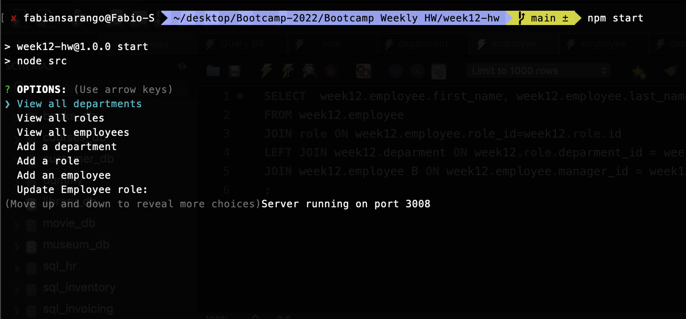
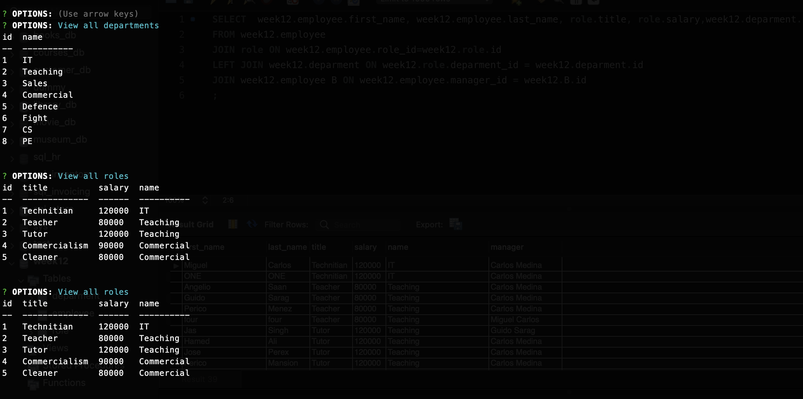

# week12-hw

## links

- [Video desmostration](https://drive.google.com/file/d/1SibmUdLOkFdAZQr9C5uZOcOx9-1MqL6e/view?usp=sharing)

# Table of Contents

- [Description](#description)
- [Installation](#Installation)
- [Usage](#Usage)
- [License](#License)
- [Contributing](#Contributing)
- [Tests](#Tests)
- [Questions](#Questions)

## Description

This app allows a manager to be able to view and manage the departments, roles, and employees in the company so that he can organize and plan my business. For the creation of this app, we have used: - mysql: To create a database - node.js : Runtime environment used to build the server. - express.js : Create a light weight server. - mySQL2.js : MySQL library that facilitates the communications between the backend and database.

## Installation

Once the repository has been cloned to your local repository follow the instructions below:

```
cd /week12-HW
npm install
```

## Usage

Move to the repository local folder

```
cd /week12-HW
```

Type the following command to run the app:

```
npm start
```

Express Employee Manager Screenshot - Options: NOTES


Express Employee Manager Screenshot - tables: NOTES


# License

This project is not covered by a license.

## Contributing

## Tests

No tests available for this task.

## Questions:

GitHub: https://github.com/frsargua

email: frsargua@gmail.com
